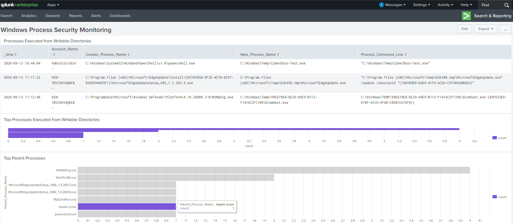

# Dashboard Panel Documentation

## Dashboard
**Windows Process Security Monitoring**

The dashboard supports analyst review of Windows Security Event ID 4688 process-creation activity. Each panel uses the tuned writable-directory logic developed and validated in this lab.

| Panel | Purpose | SPL source |
|---|---|---|
| Processes Executed from Writable Directories | Displays time, account, parent process, child process path, and command line for detailed triage. | [writable-directory-detection.spl](../spl/writable-directory-detection.spl) |
| Top Processes Executed from Writable Directories | Normalizes the child executable name and summarizes execution frequency. | [top-processes.spl](../spl/top-processes.spl) |
| Top Parent Processes | Normalizes the creator process name and shows which parents most often launch processes from writable locations. | [top-parent-processes.spl](../spl/top-parent-processes.spl) |

## Tuning Decision

The panels suppress only the validated relationship in which `cleanmgr.exe` launches a temporary `DismHost.exe`. The child process is not excluded globally, preserving visibility when it appears under another parent.

## Validation

A controlled copy of `whoami.exe`, renamed `CyberBoss-Test.exe`, was executed from `C:\Windows\Temp`. The corresponding Event ID 4688 record appeared in the detailed detection view and both aggregation panels with the expected account, parent process, child path, and command line.

## Published Evidence

The repository preserves each panel's SPL as a separate file. A Splunk dashboard XML export is not included.